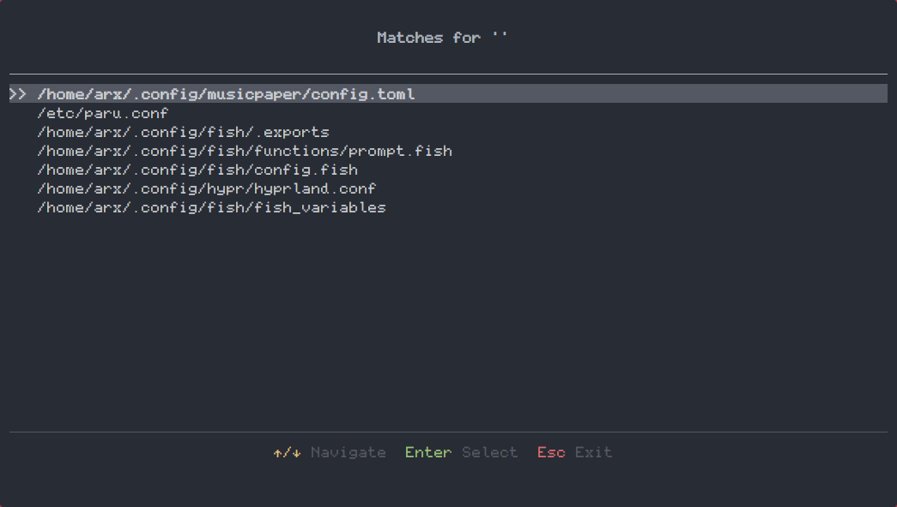

### Texoxide - Zoxide but for text files

### Docs
> Open a file with texoxide:
> `texoxide path/to/file.txt`
>
> After opening, the file will be added to an sqlite db in `~/.local/share/texoxide/`
>
> You can browse the full db by just running:
> `texoxide`
>
> You can run a focused browse using a keyword that is present in the file path and/or file name (such as):
> `texoxide fish`
> which, in my case, shows config files in `~/.config/fish/`

